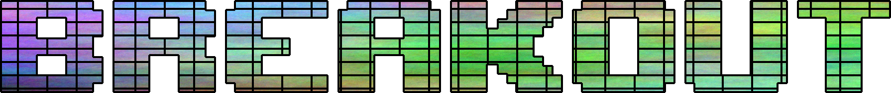
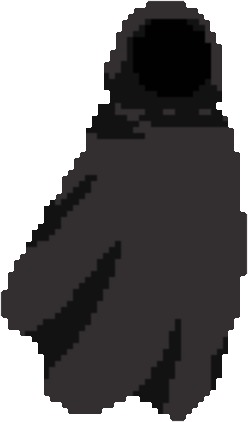

 

Projekt Breakout mit eigend entwickelten Zusatzfeatures. 
## Spielkonzept
Die Spielenden starten mit 3 Leben. Ziel ist es möglichst viele Punkte (Score) zu erreichen. Dies wird durch das Treffen und Zerstören von Blöcken, Powerups und Bossen erreicht.
Das Spiel läuft solange bis die Spielenden keine Leben mehr haben. Leben werden verloren wenn der Ball unten aus dem Bildschirm fliegt. Die restlichen Seiten sind abprallbar.
Wenn alle Blöcke zerstört wurden, steht den Spielenden eine Boss bevor. Sollte dieser Besiegt werden, spawnen alle Blöcke erneut und es geht weiter.

## Dependencies
Benötigt wird:
- GTKmm 3.0
  -> (Cairo, GDK etc)
- freetype2
  
Desweiteren wird `miniaudio` als Sound API verwendet. Die im Makefile spezifizierten Compilerflags sind getestet für macOS und Ubuntu [CIP-Pool].

## Features
> Zuerst folgen allgemeine Features.

### Audio
Dem Spiel wurden Soundeffekte, UI-Sounds sowie ein Soundtrack für den Bossfight hinzugefügt.
Alle Sounds sind im  [assets](./assets/audio/) Ordner zu finden.
Als Audio API wurde die Single-Header Bibliothek `miniaudio` verwendet.
Desweitern wurde in `sound.hpp` und `sound.cpp` eine Klasse `sound_cloud` erstellt, welche die Ressourcenverwaltung der Audiodateien, sowie das Abspielen mehrerer Sounds gleichzeitig ermöglicht.

### Bilder einfügen
Der einfachen Methode des Bildereinfügen mit `cairo_surfac` fehlt eine Ressourcenverwaltung, welche in `textures.hpp` und `textures.cpp` umgesetzt wurde. Hierbei können Bilder on demand geladen und gespeichert werden. Somit müssen die Texturen nur einmal in ihrem Lebenszyklus aus ihrer Datei gelesen werden;

> Nun folgen speziellere Features.

### Hilfsmenu
Im Startscreen des Games kann die Taste `h` gedrückt werden um ein mehrseitiges Hilfsmenu anzuzeigen. Dort befindet sich eine Übersicht der Powerups und Bosse, sowie eine kurze Erklärung zur Steuerung.

### Startrichtung bestimmen
Nach verlassen des Startscreens besteht die Möglichekti die Anfangsrichtung des Balls und Boards festzulegen.
Durch `a` und `d` kann das Board bewegt werden.
Durch `w` und `s` kann die Richtung des Balls geändert werden.
Durch `␣` startet das Spiel.

### Block Collision
Die Kollision mit den Blöcken funktioniert durch eine Schnittpunktberechnung mit den Kanten des Blockes. Somit ist diese genauer und kann seitliche Treffer verwerten.
Die Schnittpunkte und Geraden lassen sich in `breakout_config.h` durch die Debugoption `BREAKOUT_DEBUG_DRAW_BLOCK_COLLISION` anzeigen lassen.

### Blöcke mit Leben
Die Blöcke des Spiels haben 3 Leben; brauchen somit 3 Hits um zerstört zu werden. Die Leben werden durch Risse im Block symbolisiert.
Desweitern kann in der Configdatei die Debugoption `BREAKOUT_DEBUG_SHOW_LIVES` aktiviert werden um die Leben als Zahl klar dazustellen.

### Score & Combos
Dem Spiel wurde ein Score- und Combo-System hinzugefügt, welches über einen Spielzyklus den Score behält. Das Treffen von Blöcken und zerstören gibt Punkte, sowie das Powerups und das Treffen von Bossen. Die erhaltenen Punkte hängen von dem jeweiligen Combowert ab, welcher Standartmäßig bei 1 liegt und durch schnelle, hintereinander liegende Treffer von Blöcken erhöht für eine kurzen Moment.

### Board Drift
Damit die Spielenden mehr Kontrolle über den Ball haben, kann das Board dem Ball etwas Drift mitgeben. Sprich, wenn der Ball das Board trifft, während das Board in Bewegung ist, wird basierend auf der Geschwindigkeit der Ball in jene Richtung etwas stärker gelenkt. Somit erfordert das Spiel mehr Skill als nur den Ball zu treffen.

### Comfort Features
Ein paar Features die hier zusammengefasst werden beziehen sich auf das Spielerlebnis:
- Hitbox des Boards ist etwas größer links und rechts und erstreckt sich etwas tiefer, damit man Bälle "gerade noch so" treffen kann.
- Wenn der Ball vom Board abprallt wird der Abprallrichtung etwas Noise aufgerechnet, damit man Fälle wie durchgehende, senkrechte Bälle vermeidet.
- Wenn der Ball von einer der seitlichen Wände abprallt, bekommt er etwas Noise aufgerechnet, um waagerechte Dauerschleifen zu vermeiden.
- Zwischen den Blöcken ist etwas Platz, damit man den Ball dorthinein schießen kann um größere Combos zu erlangen und damit genrell mehr Action vorhanden ist.
- FPS Anzeige in der linken unteren Ecke. Kann in der Configdatei ausgestellet werden. Mittlere FPS anzahl über 30 Ticks/Frames.

### Powerups
Dem Spiel wurden Powerups hinzugefügt welche an 6 Stellen spawnen können. Die Positionen können nachträglich geändert werden oder mehr Slots erstellt werden.
In diesen Slots spwanen in semi-zufälligen Intervallen jeweils ein zufälliges Powerup. Folgende Powerups existieren und haben folgende Wirkung, welche aktiviert wird, wenn man es berührt:
|Powerup|Wirkung|
|-|-|
|Slowdown|Verlangsamt den Ball für einen Zeitraum|
|Speedup|Beschleunigt den Ball für einen Zeitraum|
|Black Hole|Zieht den Ball ins Zentrum, dreht ihn in eine Zufällige Richtung und schießt ihn anschließend in jene Richtung|
|Double Ball|Verdoppelt die Anzahl an Bällen die in dem Moment vorhanden sind|
|Lights Out|Der Bildschirm wird schwarz, bis auf einen Lichtkegel um die Bälle herum|
|Score Add/Sub|Addiert pder subtrahiert einen Wert vom derzeitigen Score|
|Invincible|Macht den Ball für eine kurze Zeit Unsterblich, sprich er prallt am unteren Bildschirmrand ab, anstatt das Spiel zu beenden|
|Gain-A-Life|Bekommen eines Lebens|

Die Powerups sind in `power_ups.hpp` und `power_ups.cpp` über eine powerup_parent Klasse umgesetzt.

### Bossfight
Wenn alle Blöcke zerstört wurden spawnt ein zufälliger Boss. Dieser hat eine Intro-Sequenz. Anschließend eine Fight-Phase [inkl. Hintergrundmusik], bei der die Spielenden den Boss beseigen können oder zu viele Leben verlieren. Somit stirbt der Boss und das Spiel geht mit frischen Blöcken erneut los, oder im Fall des Spielendentods erscheint der Gameover-Screen.

Momentan existiert ein Boss:

#### Phantom

|Ability|Beschreibung|
|-|-|
|Shadows|Mehrere Schattenwolken erscheinen und verdecken die Sicht auf das Spielfeld|
|Warp|Phantom verschwindet und taucht an einer anderen Stelle wieder auf|
|Ball-Speed|Phantom fokusiert den Ball und beschleunigt ihn für einen Moment|
|Ball-Throw|Phantom nimmt den Ball und schmeißt ihn wild umher|

### Scoreboard
Am Ende des Spiels wird neben dem jetzigen Score auch ein Scoreboard mit fünf einträgen angezeigt.
Sollte in der Runde ein höherer Score als der niedrigste der Liste erreicht worden sein, erscheint ein Eingabefeld in dem ein Name von max. 10 Zeichen (`[a-zA-Z0-9_]+`) eingegeben  und mit `↵` bestätigt werden kann.
Dieser Name wird nun mit dem erreichten Score in der Liste gespeichert.
Das Scoreboard ist persistent über mehrer Spieläufe.

## Third Party Ressourcen

|Name|File|Author|
|-|-|-|
|Audioapi |[miniaudio.c](./miniaudio.c), [miniaudio_extra.h](./miniaudio_extra.h)|[Website](https://miniaud.io)|
|Boss Grafik|[assets/bosses/phantom/main.png](./assets/bosses/phantom/main.png)|[Paulo dos Reis](https://kiyorox.artstation.com/projects/A4avz?album_id=74169)
